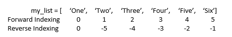

## Python
String data type:

- Order sequence that can hold a variety of object types.
- list support indexing & splicing operation.
- list element can access through forward indexing or reverse indexing
- list can be nested and also have a variety of useful methods that can be called them to perform operation.
- list is mutuable. That means, - we can change element with the help of indexing.

Example, - 

```markdown
my_list = [1, 'Two', 23.0, 'Three']
```


**Indexing Operations:**

| Input | Output |
| --- | --- |
| myString[0] | a |
| myString[8] | i |
| myString[-1] | j |
| myString[-2] | c |

**Slice Operations:**

| Input | Output |
| --- | --- |
| myString[2:] | cdefghij |
| myString[:3] | abc |
| myString[2:5] | cd |
| myString[::] | abcdefghij |
| myString[::2] | acegi |
| myString[::3] | adgj |
| myString[::-1] | jihgfedcba |

<br/><br/>
[<i class="fa fa-arrow-left"></i> **Back**](../datatypes/)
